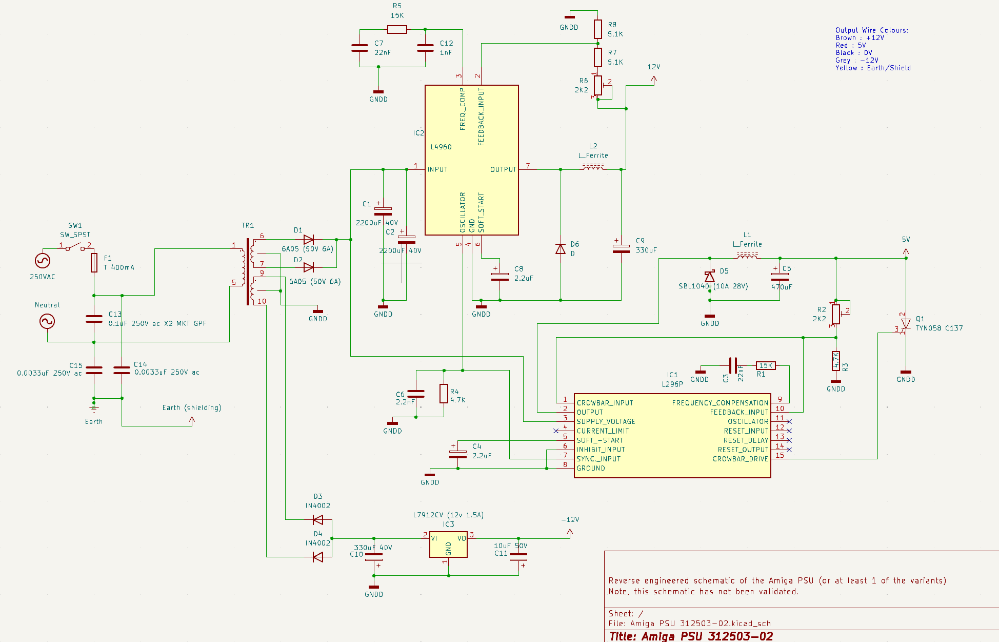

# Amiga_PSU_312503-02
Amiga PSU (Heavy brick) 312503-02 : Reverse engineered schematic / Ki-Kad

## Note : This is a 'rough' sketch, reverse engineered from the PCB.  The schematic has not been validated, and may not be entirely correct.   It also appears there are multiple variants of this PSU with the same reference (312503-02).

Ki-Kad v8 was used to create the schematic

## images
The images folder contains front and back PCB images, and were used as the basis to create the schematic

## Schematic

## Useful resources:

Amiga PSU cap list : https://blog.worldofjani.com/?p=5695

Meanwell RT50B upgrade : https://www.retro32.com/amiga-resources/030720201179-staff-project-amiga-meanwell-psu-upgrade-rt-50b-rt-65b

L296 datasheet : https://www.st.com/resource/en/datasheet/l296.pdf
KIKAD Symbols : https://componentsearchengine.com/part-view/L296P/STMicroelectronics

L4960 datasheet : https://www.mouser.co.uk/datasheet/2/389/SGSTS51597_1-2563801.pdf
KIKAD Symbols : https://componentsearchengine.com/part-view/L4960/STMicroelectronics

